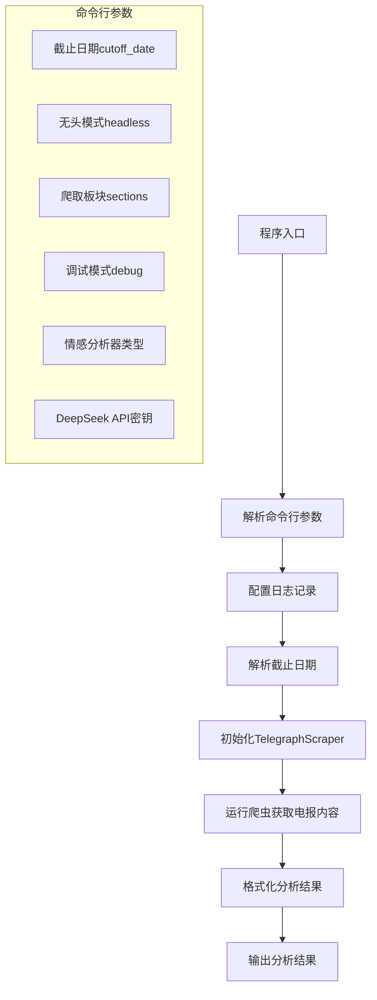
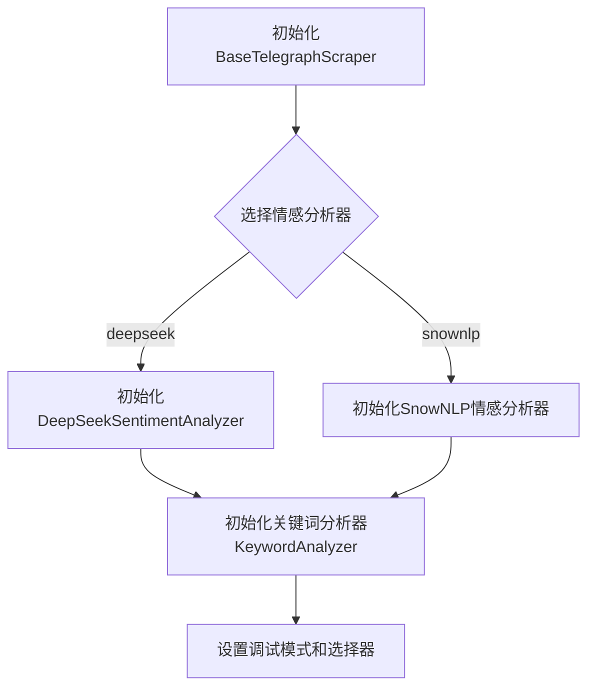
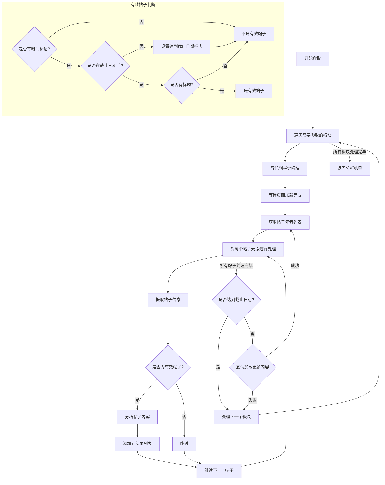
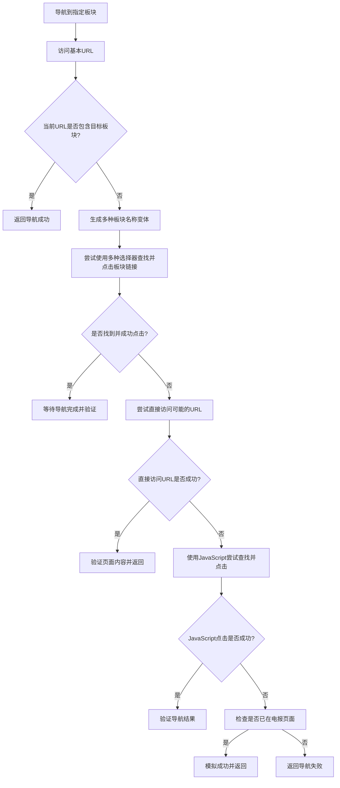
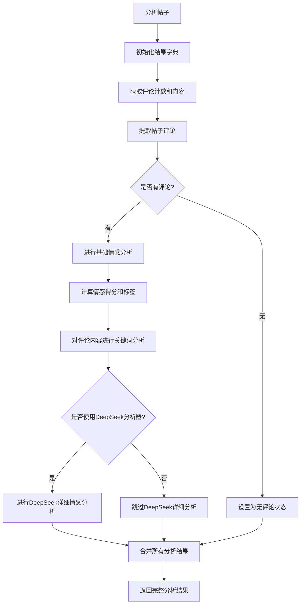
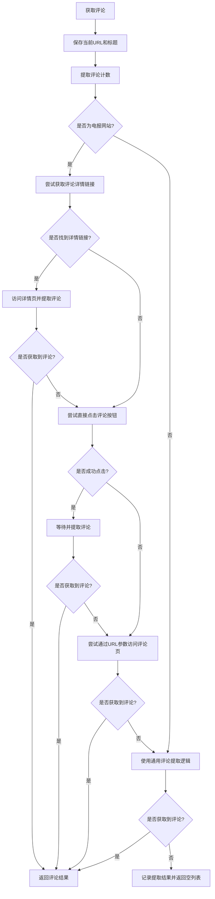
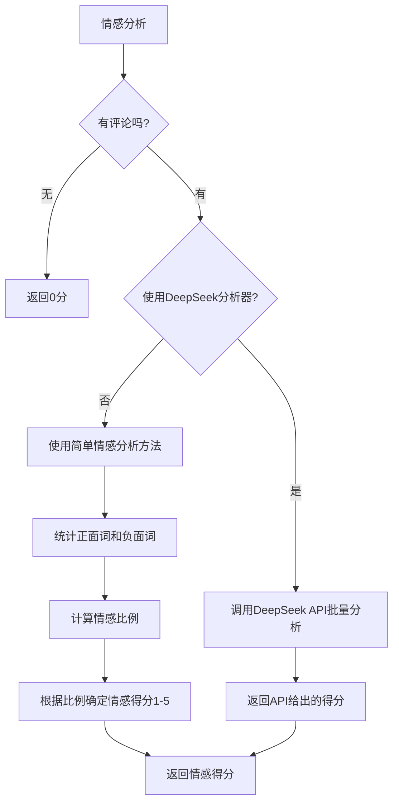
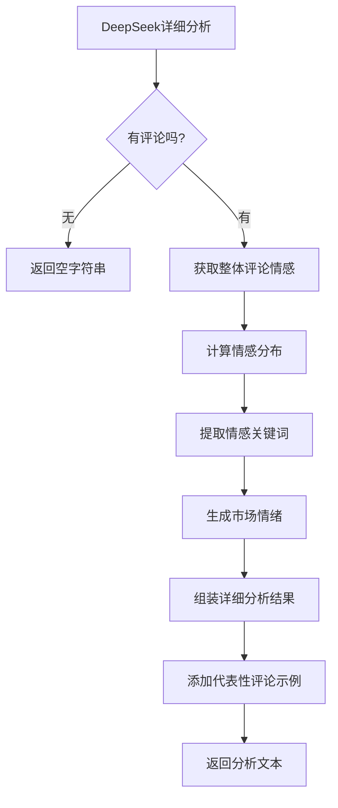
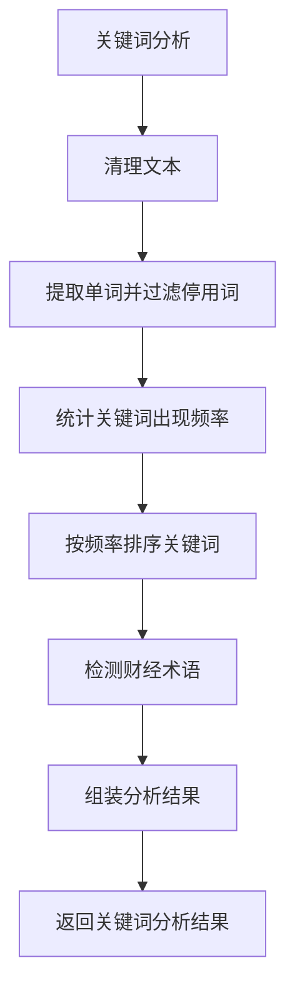
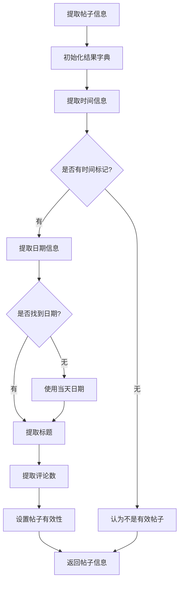

# ChoseOneAgent项目流程图分析

本文档包含ChoseOneAgent项目的详细流程图，展示了项目的主要执行流程和关键逻辑节点。

## 主程序流程图

## 爬虫初始化流程图

## 电报爬取主流程图

## 导航到指定板块流程图（后续可以根据每次执行的日志优化、调整顺序）

## 帖子分析流程图

## 评论获取流程图

## 情感分析流程图

## DeepSeek详细情感分析流程图

## 关键词分析流程图

## 帖子信息提取流程图

## 项目总结

ChoseOneAgent项目的主要功能是爬取财经网站的电报内容，并进行关键词分析和情感分析，最终返回结构化的分析结果。系统采用模块化设计，包括以下主要组件：

1. **主程序模块**：负责参数解析、配置初始化和结果输出
2. **爬虫引擎**：负责网页导航、内容提取和页面交互
3. **情感分析器**：支持多种情感分析方法，包括基于SnowNLP的简单分析和DeepSeek API的高级分析
4. **关键词分析器**：负责从文本中提取重要关键词，识别行业术语
5. **数据处理模块**：负责清洗、转换和格式化从网页中提取的数据

各组件之间通过清晰的接口进行交互，确保系统的可扩展性和可维护性。 