# ChoseOneAgent项目流程图分析

本文档包含ChoseOneAgent项目的精简流程图，展示了项目的主要执行流程和关键逻辑节点。

## 综合流程图

```mermaid
graph TD
    %% 主程序流程
    Start[程序入口] --> ParseArgs[解析命令行参数]
    ParseArgs --> InitLog[配置日志记录]
    InitLog --> ParseDate[解析截止日期]
    ParseDate --> InitScraper[初始化爬虫]
    
    %% 命令行参数
    subgraph 命令行参数
        Arg1[截止日期cutoff_date] 
        Arg2[无头模式headless]
        Arg3[爬取板块sections]
        Arg4[调试模式debug]
        Arg5[情感分析器类型]
        Arg6[DeepSeek API密钥]
    end
    
    %% 爬虫初始化
    InitScraper --> ChooseAnalyzer{选择情感分析器}
    ChooseAnalyzer -->|deepseek| InitDeepSeek[初始化DeepSeek分析器]
    ChooseAnalyzer -->|snownlp| InitSnowNLP[初始化SnowNLP分析器]
    InitDeepSeek --> InitKeyword[初始化关键词分析器]
    InitSnowNLP --> InitKeyword
    InitKeyword --> StartScrape[开始爬取]
    
    %% 主爬取流程
    StartScrape --> LoopSections[遍历板块]
    LoopSections --> Navigate[导航到指定板块]
    
    %% 导航逻辑
    Navigate --> NavBase[访问基本URL]
    NavBase --> CheckURL{URL包含目标板块?}
    CheckURL -->|是| NavSuccess[导航成功]
    CheckURL -->|否| TryVariants[尝试多种导航方法]
    TryVariants --> NavResult{导航结果}
    NavResult -->|成功| NavSuccess
    NavResult -->|失败| NavFail[导航失败]
    NavSuccess --> WaitPageLoad[等待页面加载]
    
    %% 帖子处理流程
    WaitPageLoad --> GetPosts[获取帖子列表]
    GetPosts --> ProcessPost[处理每个帖子]
    ProcessPost --> ExtractInfo[提取帖子信息]
    
    %% 帖子信息提取
    ExtractInfo --> CheckTime{有时间标记?}
    CheckTime -->|无| InvalidPost[无效帖子]
    CheckTime -->|有| CheckDate{是否在截止日期后?}
    CheckDate -->|否| ReachCutoff[设置达到截止日期标志]
    CheckDate -->|是| CheckTitle{是否有标题?}
    CheckTitle -->|否| InvalidPost
    CheckTitle -->|是| ValidPost[有效帖子]
    
    %% 有效帖子处理
    ValidPost --> AnalyzePost[分析帖子内容]
    InvalidPost --> NextPost[处理下一帖子]
    ReachCutoff --> InvalidPost
    
    %% 帖子分析流程
    AnalyzePost --> FetchComments[获取评论]
    
    %% 评论获取逻辑
    FetchComments --> SaveURLTitle[保存URL和标题]
    SaveURLTitle --> ExtractCommentCount[提取评论计数]
    ExtractCommentCount --> IsTelegraph{是否为电报网站?}
    IsTelegraph -->|是| TryMultipleMethods[尝试多种方法获取评论]
    IsTelegraph -->|否| GenericExtract[通用评论提取]
    TryMultipleMethods --> CommentsResult{获取结果}
    GenericExtract --> CommentsResult
    CommentsResult -->|成功| GotComments[获取到评论]
    CommentsResult -->|失败| NoComments[无评论]
    
    %% 情感与关键词分析
    GotComments --> BasicSentiment[基础情感分析]
    NoComments --> SetNoComment[设置无评论状态]
    
    %% 情感分析流程
    BasicSentiment --> AnalyzeType{分析器类型?}
    AnalyzeType -->|DeepSeek| DeepSeekAnalysis[DeepSeek详细分析]
    AnalyzeType -->|SnowNLP| SimpleAnalysis[简单情感分析]
    
    DeepSeekAnalysis --> CalcSentiment[计算情感得分]
    SimpleAnalysis --> WordStats[统计正负面词]
    WordStats --> CalcRatio[计算情感比例]
    CalcRatio --> CalcSentiment
    
    %% 关键词分析
    CalcSentiment --> KeywordAnalysis[关键词分析]
    KeywordAnalysis --> CleanText[清理文本]
    CleanText --> ExtractWords[提取词汇并过滤]
    ExtractWords --> CountKeywords[统计关键词频率]
    CountKeywords --> SortKeywords[排序关键词]
    SortKeywords --> DetectTerms[检测财经术语]
    
    %% 合并分析结果
    DetectTerms --> MergeResults[合并分析结果]
    DeepSeekAnalysis --> MergeResults
    SetNoComment --> MergeResults
    MergeResults --> AddToList[添加到结果列表]
    
    %% 继续流程
    AddToList --> NextPost
    NextPost --> CheckMorePosts{更多帖子?}
    CheckMorePosts -->|是| ProcessPost
    CheckMorePosts -->|否| CheckCutoff{达到截止日期?}
    CheckCutoff -->|是| NextSection[下一个板块]
    CheckCutoff -->|否| TryLoadMore{尝试加载更多}
    TryLoadMore -->|成功| GetPosts
    TryLoadMore -->|失败| NextSection
    NextSection --> CheckMoreSections{更多板块?}
    CheckMoreSections -->|是| LoopSections
    CheckMoreSections -->|否| FormatResults[格式化结果]
    
    %% 结束流程
    FormatResults --> OutputResults[输出分析结果]
    OutputResults --> End[结束]
```

## 项目总结

ChoseOneAgent项目的主要功能是爬取财经网站的电报内容，并进行关键词分析和情感分析，最终返回结构化的分析结果。系统采用模块化设计，包括以下主要组件：

1. **主程序模块**：负责参数解析、配置初始化和结果输出
2. **爬虫引擎**：负责网页导航、内容提取和页面交互
3. **情感分析器**：支持多种情感分析方法，包括基于SnowNLP的简单分析和DeepSeek API的高级分析
4. **关键词分析器**：负责从文本中提取重要关键词，识别行业术语
5. **数据处理模块**：负责清洗、转换和格式化从网页中提取的数据

各组件之间通过清晰的接口进行交互，确保系统的可扩展性和可维护性。 